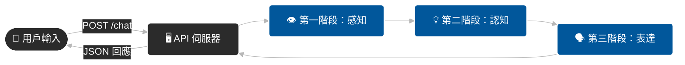
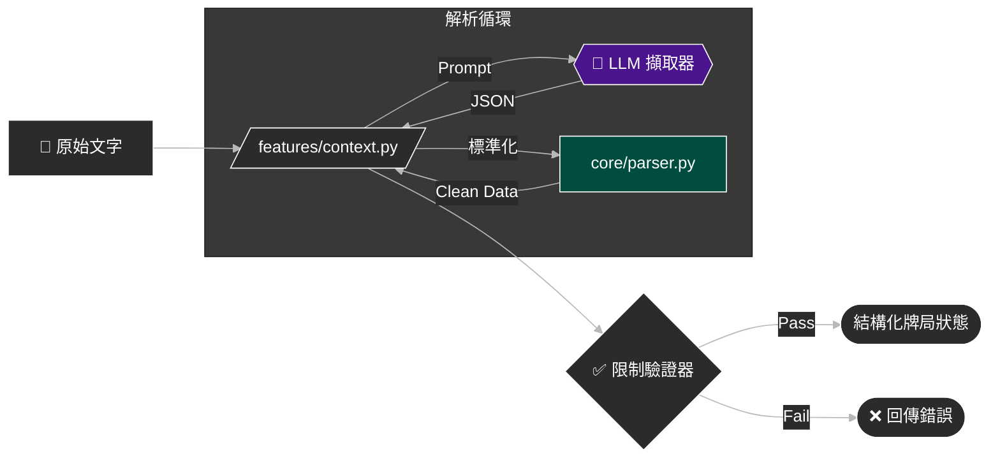
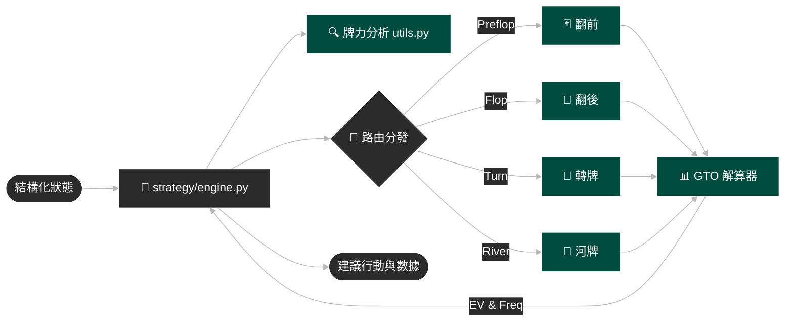
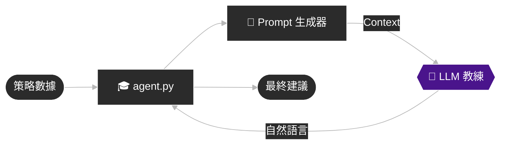
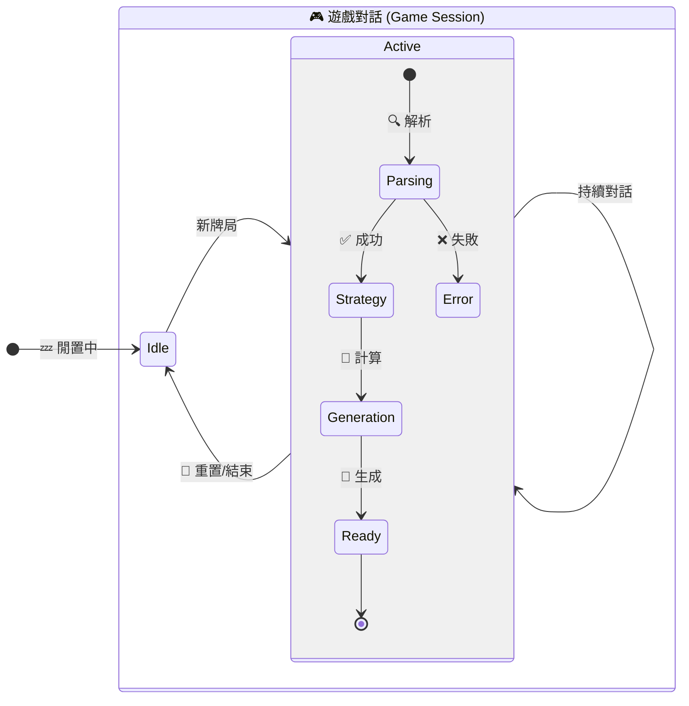

# My Poker Coach - 系統架構 (System Architecture)

## 1. 系統全貌 (High-Level Overview)

這是系統的宏觀資料流向，展示三大階段如何串接。

---

## 2. 詳細流程分解 (Detailed Workflows)

為了讓細節更清晰，我們將每個階段拆解為獨立的圖表。

### 👁️ 第一階段：感知 (Perception)
負責將自然語言轉換為結構化數據。

### 💡 第二階段：認知 (Cognition)
負責策略運算與 GTO 查詢。

### 🗣️ 第三階段：表達 (Expression)
負責生成人性化的教練建議。

---

## 3. 狀態管理 (State Management)

系統透過 `server.py` 的 `GameSession` 來維護狀態。

## 4. 元件職責詳解 (Component Responsibilities)

以下詳細說明系統各模組的具體職責、輸入輸出與關鍵邏輯。

### 1. 🖥️ API 伺服器 & 狀態控制器
-   **核心檔案**: `server.py`
-   **技術框架**: FastAPI (Python)
-   **主要職責**:
    -   **Session Management**: 維護 `GameSession` 物件，保存當前手牌的 Context (上下文) 與 Chat History (對話紀錄)，實現多輪對話記憶。
    -   **Orchestrator (協調者)**: 這是系統的總指揮，它負責按順序呼叫 Parsing -> Strategy -> Agent 三大模組，並處理它們之間的資料傳遞。
    -   **Error Handling**: 全域例外處理，確保後端崩潰時能回傳友善的錯誤訊息給前端。
    -   **Endpoint**: 
        -   `POST /chat`: 主要互動接口，接收用戶訊息，回傳 JSON 回應。
        -   `POST /reset`: 強制重置記憶，開始新牌局。

### 2. 👁️ 感知層 (Perception Layer) - 混合式解析
-   **核心檔案**: `features/context.py`, `core/parser.py`
-   **設計理念**: **"LLM for Flexibility, Code for Precision"** (LLM 負責彈性理解，程式碼負責精確運算)
-   **主要職責**:
    -   **LLM Extraction**: 使用輕量級 Prompt 要求 LLM 從自然語言中提取關鍵欄位 (如：Hero位置、手牌、行動歷史)。
    -   **Normalize (標準化)**: 透過 `core/parser.py` 將 "AKhh", "Ah Kh" 等不同格式統一為標準內部格式。
    -   **Math Resolution (數值解析)**: 解析 "半池", "2/3 pot", "all-in" 等模糊詞彙，依照當前 Pot Size 計算出精確的籌碼量 (Chips)。
    -   **Constraint Validation (限制驗證)**: 確保輸入符合撲克規則 (例：是否為 Heads-up、行動順序是否合理、必要欄位是否缺失)。如果不合法，直接拋出錯誤並提示用戶補充。

### 3. 🧠 認知層 (Cognition Layer) - 策略運算核心
-   **核心檔案**: `strategy/engine.py`, `strategy/gto.py`, `strategy/utils.py`
-   **主要職責**:
    -   **State Analysis**: 計算 SPR (Stack-to-Pot Ratio)、Pot Odds、相對位置 (IP/OOP) 等數學指標。
    -   **Hand Evaluation**: 判斷 Hero 當前牌力 (如：Top Pair, Flush Draw, Nut Advantage)。
    -   **Routing (路由)**: 根據 `street` (Preflop/Flop/Turn/River) 將控制權轉交給專門的子系統 (`strategy/streets/*.py`)。
    -   **GTO Lookup/Calculation**: 
        -   查詢預建的範圍庫 (Range Library) 或即時計算 EV。
        -   生成 **混合策略矩陣 (Mixed Strategy Matrix)** (例如：30% Check, 70% Bet)。
        -   決定最佳下注尺寸 (Sizing)。

### 4. 🗣️ 表達層 (Expression Layer) - 虛擬教練
-   **核心檔案**: `agent.py`, `services/llm_client.py`
-   **主要職責**:
    -   **Context Assembly**: 將冰冷的 JSON 數據 (如 `bet_freq: 0.7`) 轉換為 LLM 讀得懂的提示詞 (Prompt Context)。
    -   **Persona Injection**: 注入 "專業撲克教練" 的人設，確保輸出的語氣專業、鼓勵性，且能解釋 "為什麼" (Explainability)。
    -   **Advice Generation**: 生成最終回應，包含：
        -   **決策建議**: (Fold/Call/Raise) 及其頻率。
        -   **理由解釋**: 基於 GTO 理論解釋為何做此決策 (例如：「因為這裡你有範圍優勢...」)。
        -   **數據呈現**: 顯示 Pot Odds, SPR 等關鍵數據。
