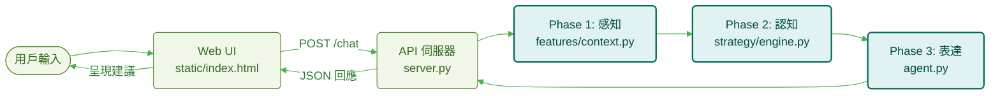
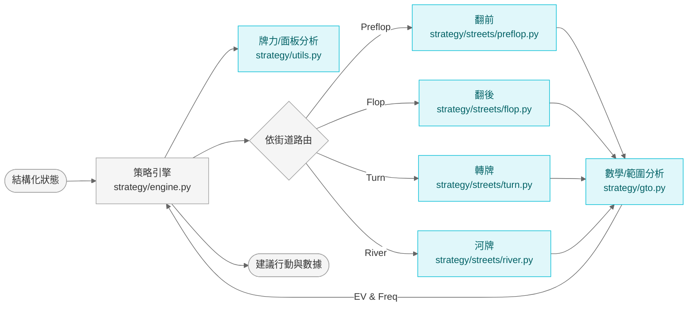
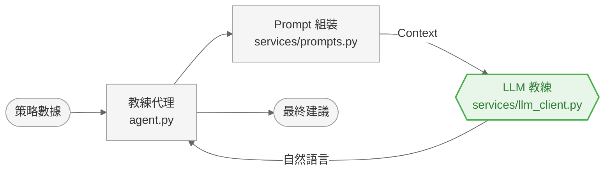
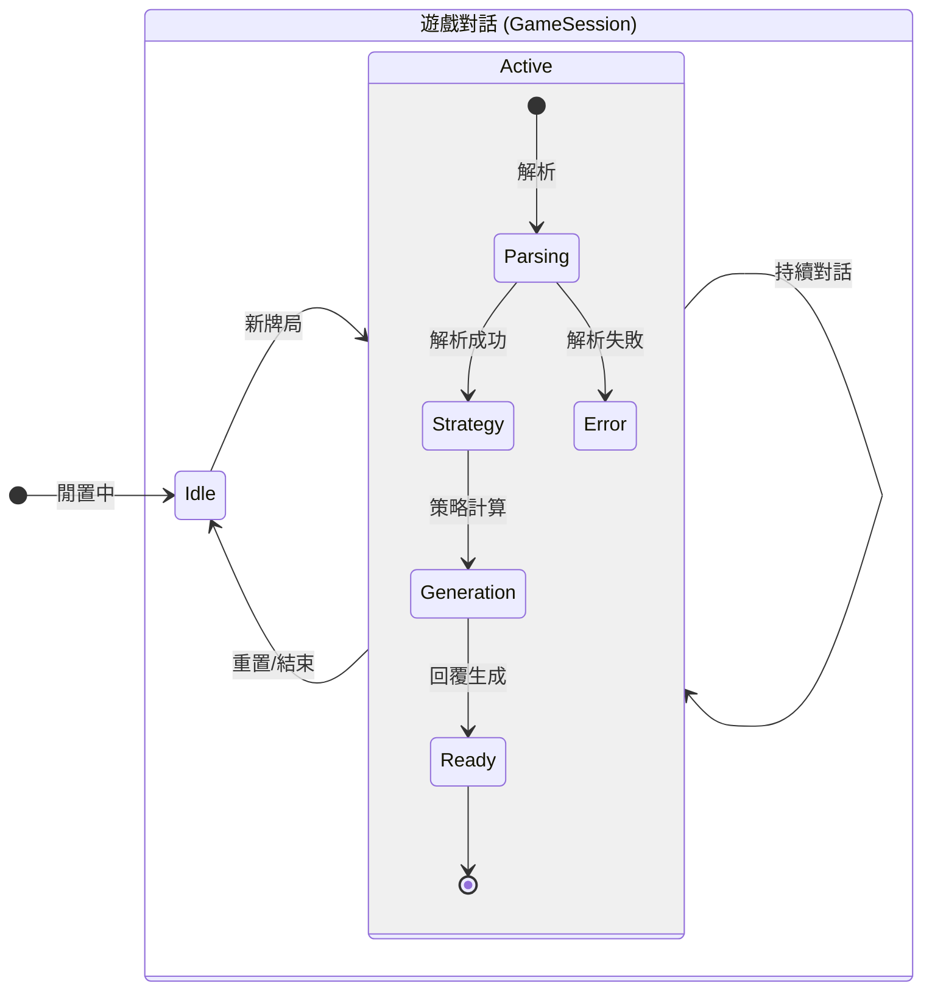

# My Poker Coach - 系統架構 (System Architecture)

## 1. 系統全貌 (High-Level Overview)

系統宏觀資料流向與三階段處理流程。用戶可透過 Web UI (`static/`) 或直接呼叫 API。



---

## 2. 詳細流程分解 (Detailed Workflows)

細節流程圖，採用參考圖中的綠/灰配色風格。

### 第一階段：感知 (Perception)
負責將自然語言轉換為結構化數據。

```mermaid
%%{init: {'theme': 'base', 'themeVariables': { 'primaryColor': '#fcfcfc', 'primaryTextColor': '#333', 'lineColor': '#666', 'edgeLabelBackground': '#ffffff'}}}%%
graph LR
    Input[用戶訊息] --> Parser[Context Parser<br/>features/context.py]
    
    subgraph Loops [解析循環]
        direction TB
        Parser -->|Prompt (services/prompts.py)| LLM{{LLM 擷取器<br/>services/llm_client.py}}
        LLM -->|JSON| Parser
        Parser -->|標準化| Core[core/parser.py]
        Core -->|Clean Data| Parser
    end
    
    Parser --> Validator{規則/限制驗證}
    Validator -->|Pass| Output([結構化牌局狀態])
    Validator -->|Fail| Error([錯誤回覆])

    %% Style: Green Headers, Grey Body
    classDef default fill:#f5f5f5,stroke:#9e9e9e,stroke-width:1px,color:#333;
    classDef llm fill:#e8f5e9,stroke:#4caf50,stroke-width:2px,color:#2e7d32;
    classDef core fill:#fff3e0,stroke:#ff9800,stroke-width:1px,color:#e65100;
    class LLM llm;
    class Core core;
```

### 第二階段：認知 (Cognition)
負責策略運算與 GTO 查詢。



### 第三階段：表達 (Expression)
負責生成人性化的教練建議。



---

## 3. 狀態管理 (State Management)

狀態機圖表對應 `server.py` 中的 `GameSession` 與對話流程。



## 4. 元件職責詳解 (Component Responsibilities)

以下詳細說明系統各模組的具體職責、輸入輸出與關鍵邏輯。

### 1. API 伺服器 & 狀態控制器
- **核心檔案**: `server.py`
- **技術框架**: FastAPI (Python)
- **主要職責**: `GameSession` 管理、解析 -> 策略 -> 表達流程協調、錯誤處理、靜態 UI 掛載。
- **Endpoints**: `POST /chat` (互動)、`POST /reset` (重置記憶)。

### 2. 感知層 (Perception Layer) - 混合式解析
- **核心檔案**: `features/context.py`, `core/parser.py`
- **相關模組**: `features/cards.py`, `strategy/pot.py`, `services/prompts.py`, `services/llm_client.py`
- **主要職責**: LLM 擷取欄位、手牌/行動正規化、籌碼與底池計算、缺失欄位補齊。
- **限制驗證**: Heads-up 限制、行動序列完整性、必要欄位檢查，不通過直接回錯。

### 3. 認知層 (Cognition Layer) - 策略運算核心
- **核心檔案**: `strategy/engine.py`, `strategy/streets/*`
- **相關模組**: `strategy/utils.py`, `strategy/eval/hand_eval.py`, `strategy/gto.py`, `strategy/ranges/*`
- **主要職責**: 牌力/面板分析、SPR/Pot Odds/MDF 等數學指標、街道路由、範圍優勢計算。
- **輸出格式**: 統一回傳 `strategy_matrix`、`amount`、`reasoning` 等欄位供後續生成。

### 4. 表達層 (Expression Layer) - 虛擬教練
- **核心檔案**: `agent.py`, `services/prompts.py`, `services/llm_client.py`
- **主要職責**: 組裝可讀的 Prompt Context (策略矩陣、尺寸、數學數據、歷史對話)。
- **人設與語氣**: 注入撲克教練風格，強調「為什麼」與可執行建議。
- **輸出處理**: 清理/防呆 LLM 回應，輸出最終建議。

### 5. 靜態前端 (Frontend UI)
- **核心檔案**: `static/index.html`, `static/script.js`, `static/style.css`
- **主要職責**: 提供聊天介面與卡牌選取器，將輸入送至 `/chat`。
- **狀態呈現**: 顯示策略建議與數據摘要，支援重置流程。
- **定位**: 純靜態前端，依賴 API 回傳的 JSON。
