# My Poker Coach - 系統架構 (System Architecture)

## 1. 系統全貌 (High-Level Overview)

系統宏觀資料流向與三階段處理流程。用戶可透過 Web UI (static/) 或直接呼叫 API。

---

## 2. 詳細流程分解 (Detailed Workflows)

細節流程圖，採用參考圖中的綠/灰配色風格。

### 第一階段：感知 (Perception)
負責將自然語言轉換為結構化數據。

```mermaid
sequenceDiagram
    participant User as 👤 User
    participant Parser as 🧩 Parser (context.py)
    participant Prompts as 📝 Prompts
    participant LLM as 🧠 LLM (Extractor)
    participant Core as 🧹 Core Parser

    User->>Parser: 輸入自然語言
    
    loop Extraction Loop
        Parser->>Prompts: 取得 EXTRACTOR_PROMPT
        
        rect rgb(255, 220, 220)
        Note right of LLM: ⚠️ 外部 AI 呼叫 (Extraction)
        Parser->>LLM: 請求解析 (JSON Mode)
        LLM-->>Parser: 回傳 JSON 結構
        end
        
        Parser->>Core: 數據清洗與標準化
        Core-->>Parser: 標準化數據
    end
    
    alt Validation Success
        Parser-->>User: 輸出結構化狀態 (Game State)
    else Validation Fail
        Parser-->>User: 回傳錯誤訊息 (請重試)
    end
```

### 第二階段：認知 (Cognition)
負責策略運算與 GTO 查詢。

```mermaid
sequenceDiagram
    participant State as 📥 Game State
    participant Engine as ⚙️ Strategy Engine
    participant Street as 🛣️ Street Logic (Flop/Turn...)
    participant Context as 📚 Range Context
    participant GTO as 📐 GTO Math

    State->>Engine: 傳入牌局狀態
    Engine->>Engine: 基礎牌力/SPR 計算
    
    Engine->>Street: 路由至對應街道 (e.g., recommend_flop)
    
    rect rgb(255, 250, 240)
    Note over Street, GTO: 核心運算區
    Street->>Context: 1. 確保範圍數據 (ensure_range_math)
    Context->>Context: 讀取並過濾 GTO 範圍
    Context-->>Street: 回傳範圍優勢/Nut Advantage
    
    Street->>GTO: 2. 計算頻率 (MDF, Bluff Ratio)
    GTO-->>Street: 回傳行動頻率
    end
    
    Street-->>Engine: 彙整策略矩陣
    Engine-->>State: 輸出完整策略數據
```

### 第三階段：表達 (Expression)
負責生成人性化的教練建議。

```mermaid
sequenceDiagram
    participant Data as 📊 Strategy Data
    participant Agent as 🤖 Agent
    participant Prompts as 📝 Prompts (System)
    participant LLM as 🧠 LLM (Coach)

    Data->>Agent: 接收策略運算結果
    
    Agent->>Agent: 🔍 數據注入 (Data Injection)
    Note right of Agent: 將範圍(Range)與範例手牌(Combos)<br/>轉化為自然語言描述
    
    Agent->>Prompts: 取得 COACH_PROMPT
    Prompts-->>Agent: 回傳 Prompt Template
    
    rect rgb(255, 220, 220)
    Note right of LLM: ⚠️ 外部 AI 呼叫 (Coaching)
    Agent->>LLM: 發送最終 Prompt (含注入數據)
    Note right of LLM: 遵循防幻覺指令進行回答
    
    LLM-->>Agent: 生成教練建議 (Markdown)
    end
    Agent-->>Data: 輸出最終回應
```

---

## 3. 狀態管理 (State Management)

狀態機圖表對應 server.py 中的 GameSession 與對話流程。

```mermaid
stateDiagram-v2
    direction LR
    
    %% Style Reference: Clean FSM with rounded corners, Red accent for start
    classDef active fill:#fff,stroke:#333,stroke-width:1px,color:#000,rx:10,ry:10;
    classDef init fill:#ffebee,stroke:#d32f2f,stroke-width:2px,color:#b71c1c,rx:10,ry:10;
    
    [*] --> Idle: 閒置中
    
    state "遊戲對話 (GameSession)" as Session {
        direction LR
        
        Idle --> Active: 新牌局
        Active --> Active: 持續對話
        
        state Active {
            direction TB
            [*] --> Parsing: 解析
            Parsing --> Strategy: 解析成功
            Parsing --> Error: 解析失敗
            
            Strategy --> Generation: 策略計算
            Generation --> Ready: 回覆生成
            
            Ready --> [*]
        }
        
        Active --> Idle: 重置/結束
    }
    
    class Idle init;
    class Active,Parsing,Strategy,Error,Generation,Ready active;
```

## 4. 元件職責詳解 (Component Responsibilities)

以下詳細說明系統各模組的具體職責、輸入輸出與關鍵邏輯。

### 1. API 伺服器 & 狀態控制器
- **核心檔案**: server.py
- **技術框架**: FastAPI (Python)
- **主要職責**: GameSession 管理、解析 -> 策略 -> 表達流程協調、錯誤處理、靜態 UI 掛載。
- **Endpoints**: POST /chat (互動)、POST /reset (重置記憶)。

### 2. 感知層 (Perception Layer) - 混合式解析
- **核心檔案**: features/context.py, core/parser.py
- **相關模組**: features/cards.py, strategy/pot.py, services/prompts.py, services/llm_client.py
- **主要職責**: LLM 擷取欄位、手牌/行動正規化、籌碼與底池計算、缺失欄位補齊。
- **限制驗證**: Heads-up 限制、行動序列完整性、必要欄位檢查，不通過直接回錯。

### 3. 認知層 (Cognition Layer) - 策略運算核心
- **核心檔案**: strategy/engine.py, strategy/streets/*
- **相關模組**: strategy/utils.py, strategy/eval/hand_eval.py, strategy/gto.py, strategy/ranges/*
- **主要職責**: 牌力/面板分析、SPR/Pot Odds/MDF 等數學指標、街道路由、範圍優勢計算。
- **輸出格式**: 統一回傳 strategy_matrix、amount、reasoning 等欄位供後續生成。

### 4. 表達層 (Expression Layer) - 虛擬教練
- **核心檔案**: agent.py, services/prompts.py, services/llm_client.py
- **主要職責**: 組裝可讀的 Prompt Context，並進行 **數據注入 (Data Injection)**，將範圍組成與範例手牌轉為文字。
- **防幻覺機制**: 透過 Prompt 強制限制 LLM 必須引用 Engine 提供的真實數據，嚴禁自行編造戰術或引用不存在的手牌。
- **人設與語氣**: 注入撲克教練風格，強調「為什麼」與可執行建議。
- **輸出處理**: 清理/防呆 LLM 回應，輸出最終建議。

### 5. 靜態前端 (Frontend UI)
- **核心檔案**: static/index.html, static/script.js, static/style.css
- **主要職責**: 提供聊天介面與卡牌選取器，將輸入送至 /chat。
- **狀態呈現**: 顯示策略建議與數據摘要，支援重置流程。
- **定位**: 純靜態前端，依賴 API 回傳的 JSON。
